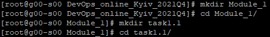
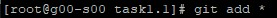

1. Install GIT on your workstation.
 
 
 
2. Setup git: change your global configs (add name and email, setup core text editor).
 
 
 
3 - 6. Clone repo to your workstation.
  
  
  
7 - 8. Do all your experiments in folder “task1.1”.
  
  
  
9 - 10. Create readme.txt. Make init commit.
  
  
  
  
 
 
  
11. Create develop branch and checkout on it.
  
  
  
12. Create index.html empty file. Commit.
  
  
  
  
  
13. Create branch with name “images”. Checkout on it. Add images folder with some images inside it. Commit.
  
  
  
  
  
14. Change your index.html. Add images source inside it. Commit.
  
  
 
 
  
15. Go back to develop branch.
  
  
  
16. Create branch with name “styles”. Checkout on it. Add styles folder with styles source inside it. Commit.
 
 
 
17. Change your index.html. Commit.
 
 
 
18. Go to develop branch.
 
 
 
19. Merge two new branches into develop using git merge command. Resolve conflict if it appear. Do it in next sequence:
•merge “images” into “develop”
•merge “styles” into “develop”

20 - 23. Push all your changes with all your branches to origin (git push origin --all).
 
 
 
24 - 25. Add task1.1_GIT.txt to your local repo in then Push it in GitHub repo.
 
 
 
26. Make file readme.md in folder task1.1 and describe results of your work with Git.
In this module I am on practice applied knowledge about git. First I am setup global configure. In this task I face to merge problem when merge “styles” into “develop”.
27. Describe in your own words what DevOps is. Try to use not more 50 words. Do not use ctrl-C/ctrl-V.
28. Insert your text about DevOps in readme.md
DevOps is an actual culture or idea of a team approach to solving problems in software development in order to reduce company costs and reduce the workload.
