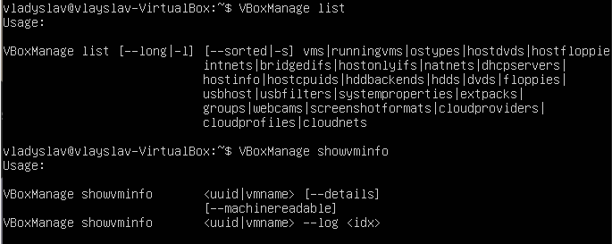
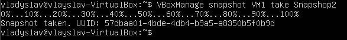
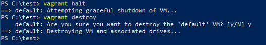

PART 1. HYPERVISORS
1. What are the most popular hypervisors for infrastructure virtualization?

The most popular virtualization solutions at the moment are VMWare Workstation, OracleVM VirtualBox, Microsoft Hyper-V, Parallels Hypervisor, and Red Hat Enterprise Virtualization.

2. Briefly describe the main differences of the most popular hypervisors.

Oracle VM VirtualBox is an open source hosted hypervisor that runs on a host OS to support guest VMs.  VirtualBox is completely free. VirtualBox supports a variety of host OSes, such as Windows, Apple macOS, Linux and Oracle Solaris. VirtualBox offers multigeneration branched snapshots, Guest Additions, guest multiprocessing, ACPI support and Preboot Execution Environment network boot.
VMware Workstation Pro is a 64-bit hosted hypervisor capable of implementing virtualization on Windows and Linux systems. Some of Workstation's features include host/guest file sharing, the creation and deployment of encrypted VMs, and VM snapshots.
Microsoft Hyper-V runs on Windows OSes and enables admins to run multiple OSes inside a VM. Admins and developers often use Hyper-V to build test environments to run software on several OSes by creating VMs for each test.
Red Hat Enterprise Virtualization (RHEV) is a commercial implementation of the KVM Type-1 hypervisor. Red Hat Enterprise Virtualization uses SPICE protocol and VDSM (Virtual Desktop Server Manager) with a RHEL-based centralized management server.

PART 2. WORK WITH VIRTUALBOX

1. First run VirtualBox and Virtual Machine (VM).

1.1 – 1.6 Clone an existing VM1 by creating a VM2 [1, ch.1.14].
 
 
 
1.7 Create a group of two VM: VM1, VM2 and learn the functions related to groups [1, 
ch.1.10].
  
  
  
1.8 For VM1, changing its state, take several different snapshots, forming a branched tree of snapshots [1, ch.1.11].
   
   
   
1.9 Export VM1. Save the *.ova file to disk. Import VM from *.ova file [1, ch.1.15].
 
  
  
 
2. Configuration of virtual machines
2.1 Explore VM configuration options (general settings, system settings, display, storage, audio, network, etc.).
2.2 Configure the USB to connect the USB ports of the host machine to the VM
[1, ch.3.11].

   

2.3 Configure a shared folder to exchange data between the virtual machine and the host [1, ch.4.3].
   
   

2.4 Configure different network modes for VM1, VM2. Check the connection between VM1, VM2, Host, Internet for different network modes. You can use the ping command to do this. Make a table of possible connections.
Table of possible connections.
   

3. Work with CLI through VBoxManage.

3.1 Run the cmd.exe command line.

3.2 Examine the purpose and execute the basic commands of VBoxManage list, showvminfo, createvm, startvm, modifyvm, clonevm, snapshot, controlvm [1, ch.8].
   
   
   

PART 3. WORK WITH VAGRANT
1. Download the required version of Vagrant according to the instructions [5] and according to the host operating system (OS) installed on the student's workplace. For Windows, the file may be called, for example, vagrant_2.2.0_x86_64.msi. Install Vagrant. Check the path to Vagrant bin in the Path variable (My computer -> Properties -> Advanced system settings -> Advanced -> Environment Variables).
2. Run the powershell. Create a folder "student name" (in English). In this example, create a folder vagrant_test. Next, go to the folder.
3. Initialize the environment with the default Vagrant box: init hashicorp/precise64
5. Run vagrant up and watch for messages during VM boot and startup.

 

6. Connect to the VM using the program PuTTY (can be downloaded from [6]), using SSH, IP address and port listed above (127.0.0.1:2222). By default, login – vagrant and password are also vagrant
7. Record the date and time by executing the date command

 

8. Stop and delete the created VM.

 

9. Create your own Vagrant box [7]

 

10. (optional) Create a test environment from a few servers. Servers' parameters are chosen independently by the student.
