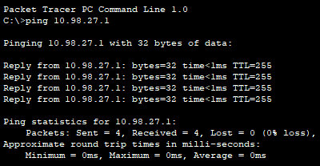

    Task 3

1. Топологія мережі:

 

2. Додаткове завдання: Дослідження структури пакету за допомогою аналізатора пакетів Wireshark

 

MAC-адреса відправника: 40:49:0f:7f:ed:b3
MAC-адреса отримувача: 00:1f:c6:8c:fd:12
IP-адреса відправника: 192.168.1.3
IP-адреса отримувача: 185.199.111.154
TCP-порт відправника: 443
TCP-порт отримувача: 63902

3. Перевірка зв'язоку комп’ютерів з власними шлюзами за допомогою команди ping

 

4. Перевірка зв’язоку між серверами за допомогою команди ping та маршрут проходження пакета за допомогою tracert

 

5. Налаштування маршрутизації між VLAN (додаткове завдання)

 

6. Перевірка працездатність за допомогою команди ping та tracert з одного сервера на інший

 

7. Налаштування таблиці маршрутизації на маршрутизаторах ISP1, ISP2 та ISP3.

 

8. Перевірка працездатність мережі за допомогою команди ping та tracert. 

 

9. Налаштування динамічної маршрутизації (додаткове завдання). Налаштувати протоколу RIP.

 

10. Перевірка працездатність мережі за допомогою команди tracert.

 

11. Налаштування DHCP Pool.

 

12. Перевірка працездатність сервісу, поставивши в налаштуваннях Client 1 та Client2 DHCP

 

13. Налаштування DNS сервера (внесені відповідні записи).

 

14. Перевірка працездатність шляхом відправки ping з Client на доменне ім’я.

 

15. Налаштування Port Forwarding на Home Router (додаткове завдання).

 

16. Додавання на DNS Server запис для Home Server.

 

17. Перевірка працездатність шляхом уведення на Client1 у Desktop/Web Browser domain3.com

 

