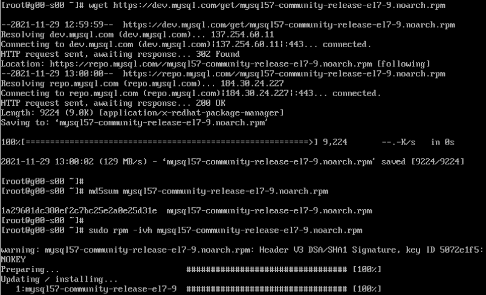
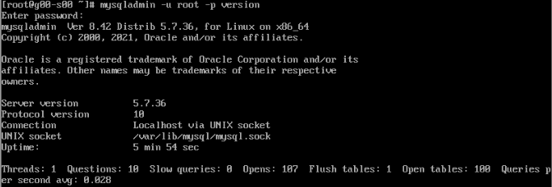
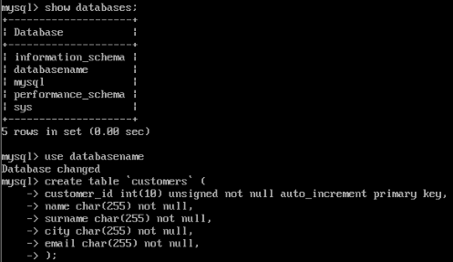
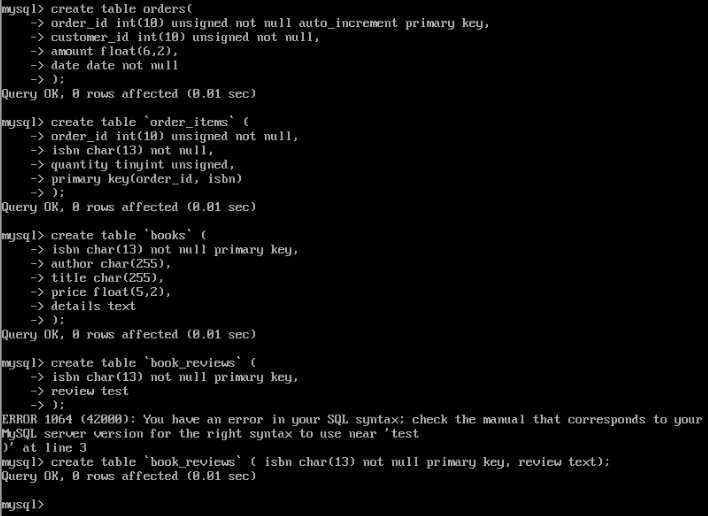
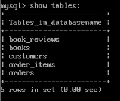
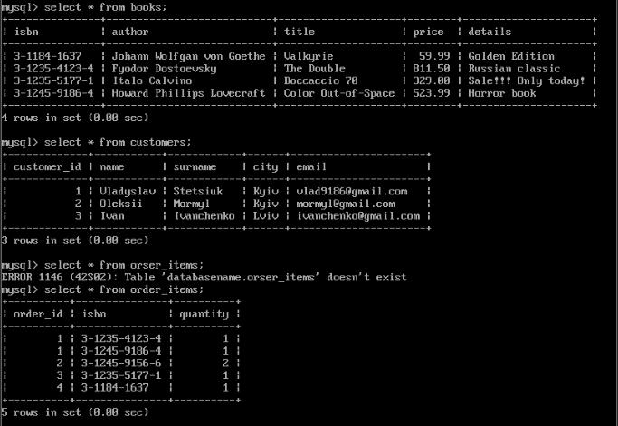
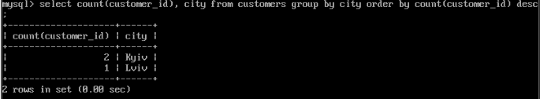

TASK 4.1
PART 1
1.1 Installed and Created database schema

 
 
 

I was building a bookstore base. There are 5 tables in my database.
1.2 Created database and tables on the server

 

 

1.3 Filled some informations in tables

 

 

1.4 Executed SELECT operator
Selected count of people from each city and sorted from greater to low.

 

Selected names and surnames from customers table where date greater than '2021-10-29' and where customer ID equals orders ID.
That is select everyone who bought book after '2021-10-29'.

 

