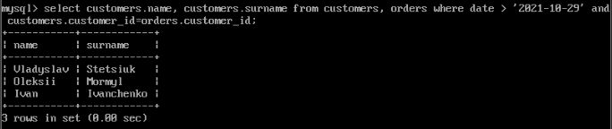
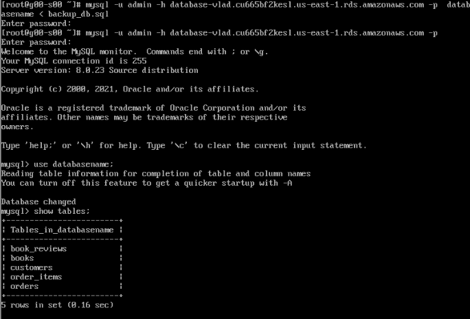

TASK 4.1

PART 1

1.1 Installed and Created database schema

 
 
 

I was building a bookstore base. There are 5 tables in my database.
1.2 Created database and tables on the server

 

 

1.3 Filled some informations in tables

 

 

1.4 Executed SELECT operator
Selected count of people from each city and sorted from greater to low.

 

Selected names and surnames from customers table where date greater than '2021-10-29' and where customer ID equals orders ID.
That is select everyone who bought book after '2021-10-29'.

 

1.5 Make a selection from the main table DB MySQL.

 

 

PART 2

2.1 Make backup of your database.

 

2.2 Delete the table and/or part of the data in the table.

 

2.3 Restore your database.

 

2.4-2.5 Transfer your local database to RDS AWS. Connect to your database.

 

 

2.6 Execute SELECT operator similar step 6.

 

2.7 Create the dump of your database.

 

PART 3

3.1 Create an Amazon DynamoDB table

 

3.2 Enter data into an Amazon DynamoDB table.

 

3.3 Query an Amazon DynamoDB table using Query and Scan.

Scan:
 

 

Query:

 
