Task2
Task assignment.

1) Analyze the structure of the /etc/passwd and /etc/group file, what fields are present in it, what users exist on the system? Specify several pseudo-users, how to define them?

 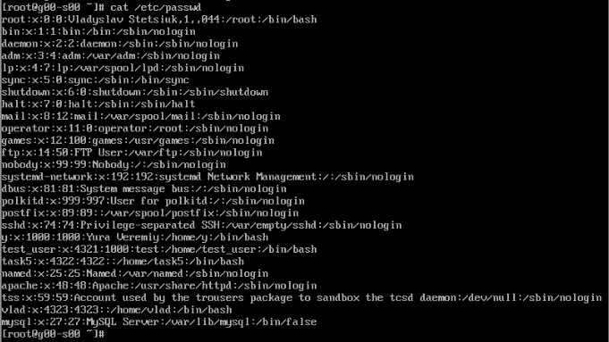

 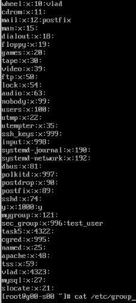

2) What are the uid ranges? What is UID? How to define it? What is GID? How to define it?

UID- unique identifier of the user within the system
GID - unique identifier of the group within the system to which the user belongs

 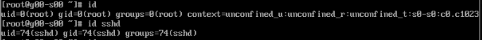

4) How to determine belonging of user to the specific group?

 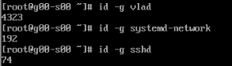

5) What are the commands for adding a user to the system? What are the basic parameters required to create a user?

useradd - low-level utilty for creating user accounts. But even after password setting it requires creating home catalog for login.
adduser - high-level utility, by default not existed in some distributions. The low-level utility useradd is used as a backend.
It creates full user account including home catalog. The new user is ready to log in through your login manager or in text mode.

 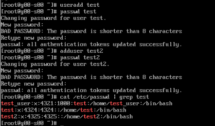

6) How do I change the name (account name) of an existing user?

 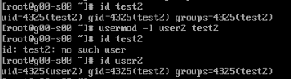

7) What is skell_dir? What is its structure?

 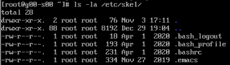

8) How to remove a user from the system (including his mailbox)?

Use key -r(-remove) in order to delete user home catalog and mail folder "userdel -r username"

9) What commands and keys should be used to lock and unlock a user account?

 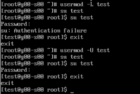

10) How to remove a user's password and provide him with a password-free login for subsequent password change?

 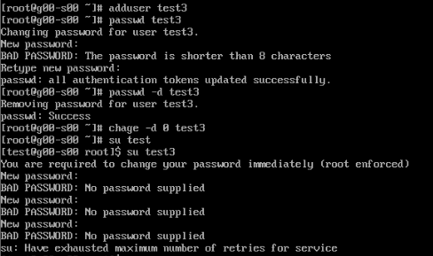

11) Display the extended format of information about the directory, tell about the information columns displayed on the terminal.

 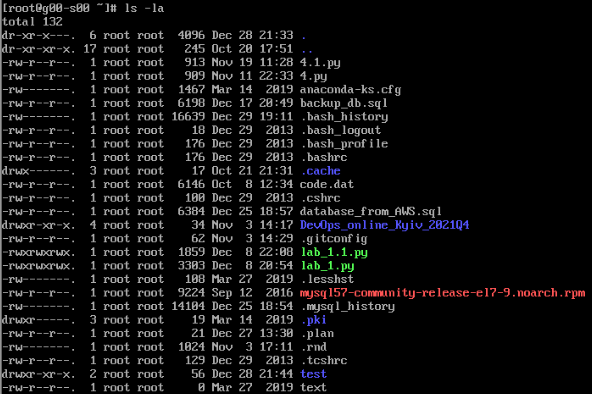

12) What access rights exist and for whom (i. e., describe the main roles)? Briefly describe the acronym for access rights.

 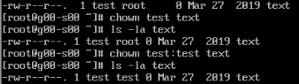

13) What is the sequence of defining the relationship between the file and the user?

Here is sequence of rights:
--- - no rights at all;
--x - only execution of the file is allowed as a program, but not modification or reading;
-w- - only writing and changing the file is allowed;
-wx - modification and execution are allowed, but in the case of a directory, you cannot see its contents;
r-- - read-only rights;
r-x - read only and execute, no write permission;
rw- - read and write permissions, but no execution;
rwx - all rights;
--s - SUID or SGID bit is set, the first is displayed in the field for the owner, the second for the group;
--t - sticky-bit is installed, which means users cannot delete this file.

14) What commands are used to change the owner of a file (directory), as well as the mode of access to the file? Give examples, demonstrate on the terminal.

 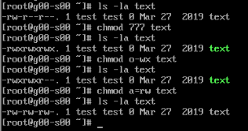

15) What is an example of octal representation of access rights? Describe the umask command.

 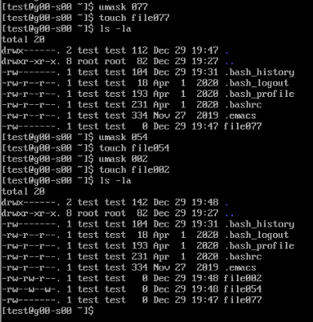

16) Give definitions of sticky bits and mechanism of identifier substitution. Give an example of files and directories with these attributes.

SUID (Set User ID) is flags permissions on Unix, which allow users to run files with the rights of the owner of the executable files.

SGUID (Set Group ID) is flags permissions on Unix, which allow users to run files with the rights of group owner of the file.
 
 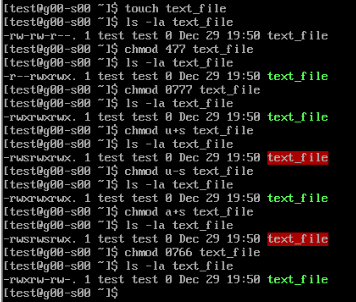

Sticky bit is useful permission for protecting files from accidental deletion in an environment where multiple users have write access to the same directory.
If the sticky bit is set, the user can delete the file only if he is the user who owns the file or directory that contains the file.
Example how to set sticky bit:

 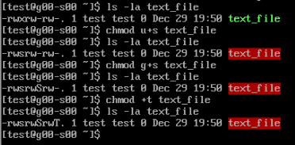

17) What file attributes should be present in the command script?

Command script should be executable for running command. In order to set it we should set execute access to file using chmod command:
"chmod ugo+x file.txt"
