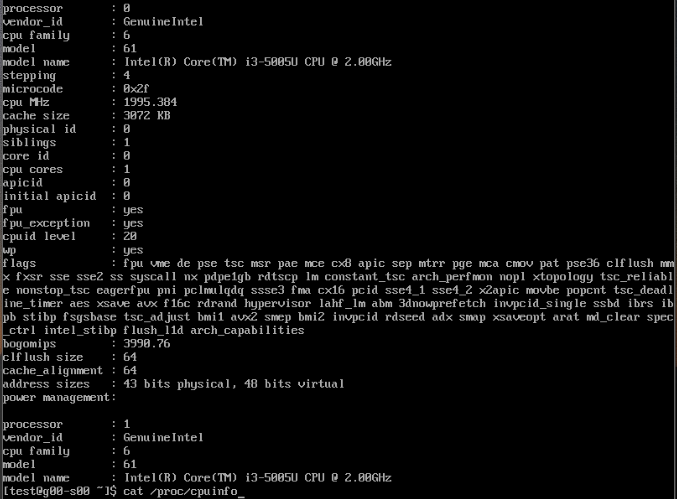
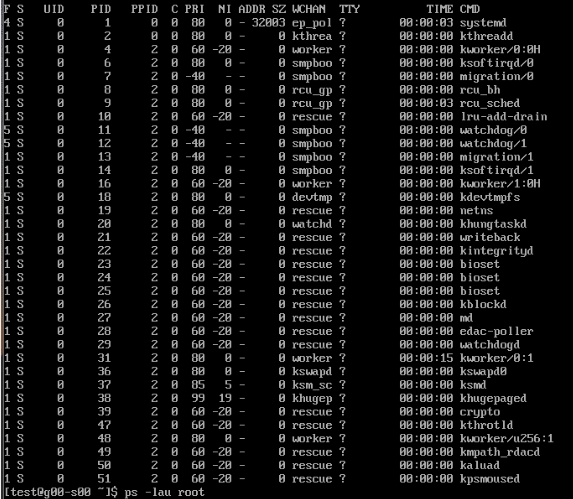
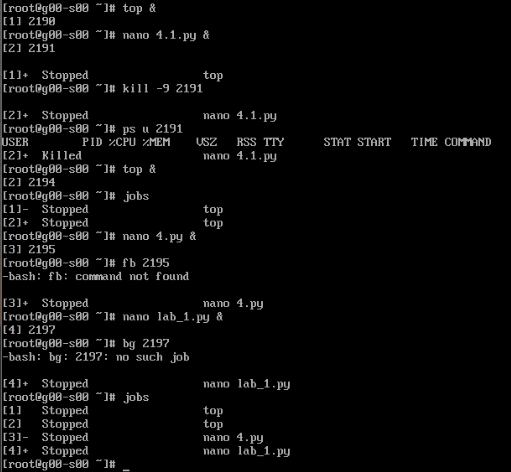
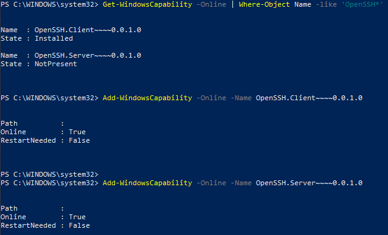

TASK5.3
Part1

1. How many states could has a process in Linux?

Processes in Linux have a several status:
R – Running or runnable;
D – Uninterruptible sleep or wait writing on the disk;
S – Interruptible sleep;
T – Stopped, either by a job control signal or because it is being traced;
Z – Defunct (“zombie”) process, terminated but not closed by the parent process that created it.

2. Examine the pstree command. Make output (highlight) the chain (ancestors) of the current process.

 

3. What is a proc file system?

 

4. Print information about the processor (its type, supported technologies, etc.).

 

 

5. Use the ps command to get information about the process. The information should be as follows: the owner of the process, the arguments with which the process was launched for execution, the group owner of this process, etc.

 

6. How to define kernel processes and user processes?

 

7. Print the list of processes to the terminal. Briefly describe the statuses of the processes. What condition are they in, or can they be arriving in?

 

8. Display only the processes of a specific user.

 

9. What utilities can be used to analyze existing running tasks (by analyzing the help for the ps command)?

 

 

 

10. What information does top command display?

Top command is used to show the Linux processes.
This Linux command will sort the list by CPU usage, so the process which consumes the most resources will be placed at the top.

11. Display the processes of the specific user using the top command.

 

12. What interactive commands can be used to control the top command? Give a couple of 
examples.

There are some interactive commands that can be used during top command work:

A - see group of process, Z - change color of info
 

h - see manual
 

13. Sort the contents of the processes window using various parameters (for example, the 
amount of processor time taken up, etc.)

Shift + N - by PID
 

Shift + T - by working time
 

14. Concept of priority, what commands are used to set priority?

 

15. Can I change the priority of a process using the top command? If so, how?

Use r command
 

16. Examine the kill command. How to send with the kill command
process control signal? Give an example of commonly used signals.

 

17. Commands jobs, fg, bg, nohup. What are they for? Use the sleep, yes command to 
demonstrate the process control mechanism with fg, bg.

 

Part2

1. Check the implementability of the most frequently used OPENSSH commands in the MS 
Windows operating system. (Description of the expected result of the commands + 
screenshots: command – result should be presented)

 

 

2. Implement basic SSH settings to increase the security of the client-server connection (at least 

 

3. List the options for choosing keys for encryption in SSH. Implement 3 of them.

 

 

 

 

 

4. Implement port forwarding for the SSH client from the host machine to the guest Linux virtual machine behind NAT.

 

5*. Intercept (capture) traffic (tcpdump, wireshark) while authorizing the remote client on the server using ssh, telnet, rlogin. Analyze the result

 

 

 
