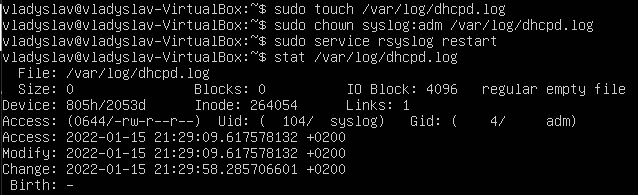

Configuring DHCP, DNS servers
1. Use already created internal-network for three VMs (VM1-VM3). VM1 has NAT and internal, 
VM2, VM3 – internal only interfaces.
VM1:
 
VM2:
 
VM3:
 

2. Install and configure DHCP server on VM1. 
(3 ways: using VBoxManage, DNSMASQ and ISC-DHSPSERVER). 
You should use at least 2 of them.
 
 
 
 
 

 
 
 
 
 

3. Check VM2 and VM3 for obtaining network addresses from DHCP server.
 
 
 

4. Using existed network for three VMs (from p.1) install and configure DNS server on VM1. (You can use DNSMASQ, BIND9 or something else)

 
