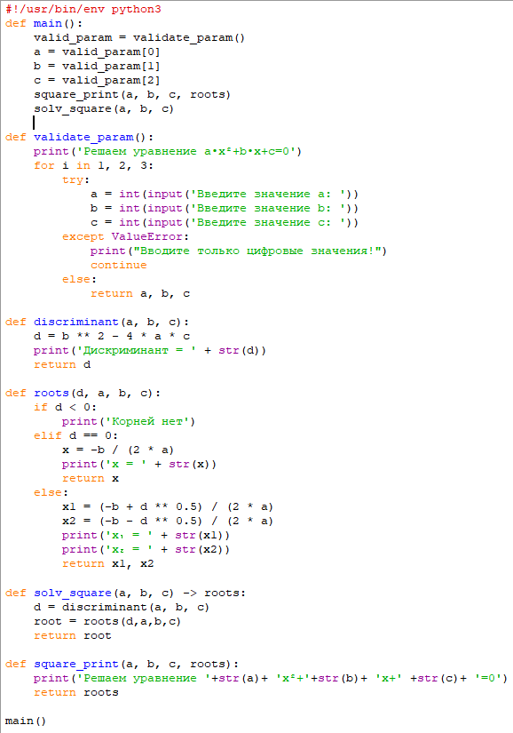
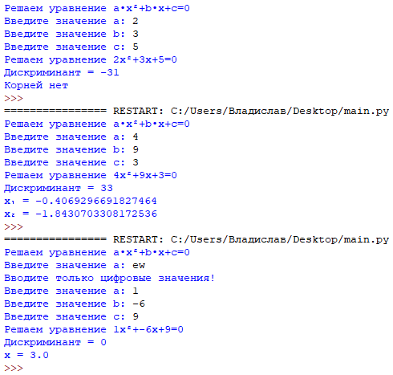
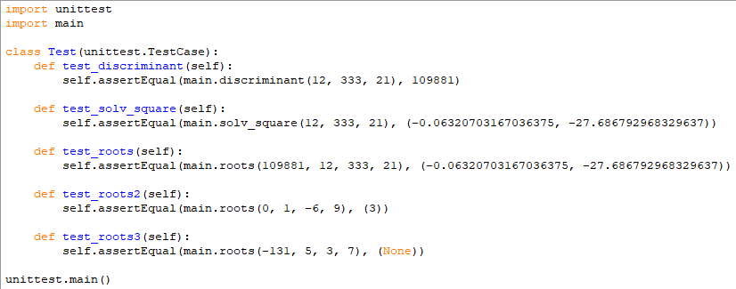
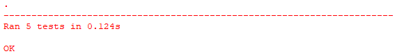

Module Python Essentials 
TASK - 01. 
Реализовать скрипт, который решает квадратное уравнение вида 𝑎𝑥ଶ + 𝑏𝑥 + 𝑐 = 0. 
Параметры квадратного уравнения 𝑎, 𝑏, 𝑐 задаются вводом или через аргументы командной строки. 
В скрипте реализовать несколько функций, которые декомпозируют задачу решения квадратного 
уравнения. В эти функции должны передаваться параметры. Также на эти функций написать UnitTests. 
Основной скрипт solv_square_equation.py должен иметь следующие функции: 
- main() 
- validate_param(int) - проверяет, что введено число, повторяет ввод 3 раза если не число 
(использовать exception) 
- discriminant(a, b, c) 
- roots(d, a, b, c) 
- solv_square(a, b, c) -> roots 
- square_print(a, b, c, roots) – выводит на экран результат 

Program code:

 

Result:

 

на выделенные написать UnitTest. 
Не использовать глобальные переменные. 

Program code:

 
 
 Result:

 
